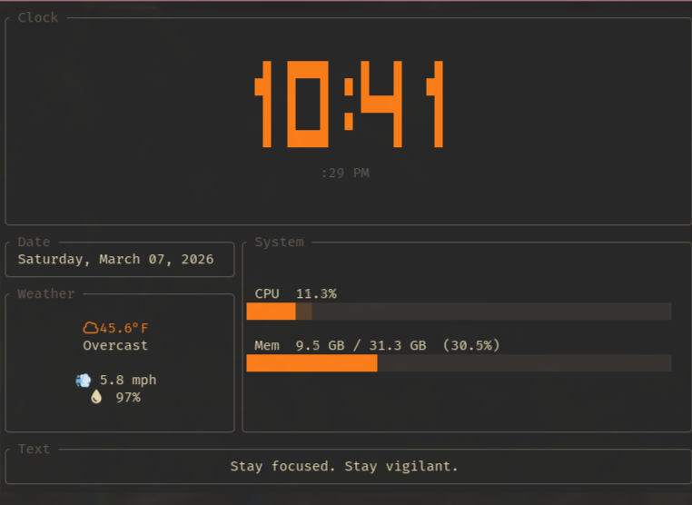

# vigil-tui

A configurable terminal dashboard built with Rust and [ratatui](https://ratatui.rs).




## Features

- **Widget system** — trait-based architecture, easy to extend
- **Built-in widgets** — clock (ASCII art), weather, date, system stats, text
- **Two layout modes** — absolute (percentage positioning) or rows (stacked, flex-like)
- **Column stacking** — stack multiple zones vertically within a row column using `col`
- **Theme presets** — gruvbox, catppuccin-mocha, catppuccin-latte, nord, tokyo-night, dracula, solarized-dark
- **Custom themes** — define your own colors and border style
- **TOML config** — named zones with per-widget configuration
- **Hot reload** — auto-reloads on config file save, or press `r` manually
- **Cross-platform** — works on Linux, macOS, and Windows

## Install

```sh
cargo install --path .
```

## Usage

```sh
vigil-tui                    # uses ~/.config/vigil-tui/config.toml
vigil-tui path/to/config.toml  # explicit config path
```

On first run, a default config is created at `~/.config/vigil-tui/config.toml`.

### Keybindings

| Key | Action |
|-----|--------|
| `q` / `Ctrl+C` | Quit |
| `r` | Force reload config |

Config is also reloaded automatically whenever the file is saved. If a reload fails (e.g. syntax error), the previous working config stays active and a red error banner appears at the bottom of the screen until the next successful reload.

## Configuration

Layout mode determines how zones are positioned:

- **`rows`** — zones stack top-to-bottom. Heights are in character rows. Zones sharing a `row` value form columns. Widths are percentages within the row.
- **`absolute`** — all x/y/width/height values are percentages of the terminal.

```toml
layout = "rows"
theme = "catppuccin-mocha"

[[zones]]
id = "clock"
widget = "clock"
height = 13

  [zones.config]
  format = "12hr"

# These three share row 2 — they become columns
[[zones]]
id = "weather"
widget = "weather"
row = 2
width = 33

  [zones.config]
  latitude = 40.7128
  longitude = -74.0060
  units = "fahrenheit"

[[zones]]
id = "date"
widget = "date"
row = 2
width = 34

  [zones.config]
  format = "%A, %B %d, %Y"

[[zones]]
id = "stats"
widget = "system"
row = 2
width = 33

[[zones]]
id = "quote"
widget = "text"
height = 3

  [zones.config]
  content = "Stay focused. Stay vigilant."
```

### Column Stacking

Zones with the same `row` and `col` value stack vertically within that column. This lets you create layouts where one column has multiple smaller zones while another spans the full row height:

```
+-----------+-----------+
|  widget1  |           |
+-----------+  widget3  |
|  widget2  |           |
+-----------+-----------+
```

```toml
[[zones]]
id = "widget1"
widget = "clock"
row = 1
col = 1
width = 50
height = 8

[[zones]]
id = "widget2"
widget = "text"
row = 1
col = 1
width = 50
height = 5

[[zones]]
id = "widget3"
widget = "system"
row = 1
col = 2
width = 50
height = 13
```

Zones without `col` each get their own column automatically (backward compatible).

## Widgets

| Widget | Config options |
|--------|---------------|
| `clock` | `format`: `"12hr"` or `"24hr"` |
| `weather` | `latitude`, `longitude`, `units` (`"fahrenheit"` / `"celsius"`) |
| `date` | `format`: chrono format string (e.g. `"%A, %B %d, %Y"`) |
| `system` | CPU and memory usage bars |
| `text` | `content`, `title`, `align` (`"left"` / `"center"` / `"right"`) |

## Themes

Use a preset name or define a custom theme block:

```toml
# Preset
theme = "gruvbox"

# Custom
[theme]
fg = "#cdd6f4"
bg = "#1e1e2e"
accent = "#89b4fa"
dim = "#585b70"
border = "rounded"
```

Available presets: `gruvbox`, `catppuccin-mocha`, `catppuccin-latte`, `nord`, `tokyo-night`, `dracula`, `solarized-dark`

## License

MIT
